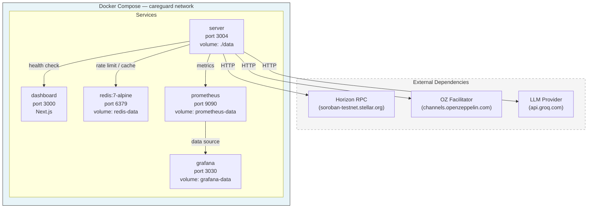
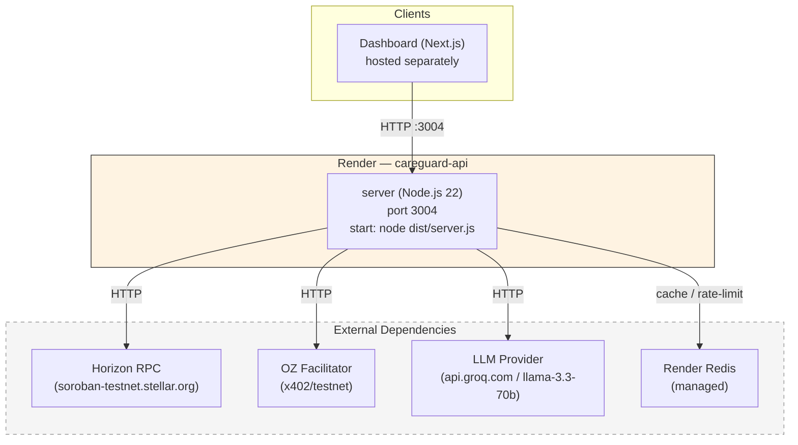

# Deployment Topology

## Docker Compose (Local Dev)

The local development stack runs five services on a shared bridge network (`careguard`).
Persistent data is kept in named Docker volumes.

### Port Map

| Service | Internal Port | Host Port |
|---------|---------------|-----------|
| server  | 3004          | 3004      |
| dashboard | 3000        | 3000      |
| redis   | 6379          | 6379      |
| prometheus | 9090      | 9090      |
| grafana | 3000          | 3030      |

### Persistent Volumes

| Volume | Mount | Purpose |
|--------|-------|---------|
| `./data` | `/app/data` | Server data (spending history, audit logs) |
| `redis-data` | `/data` | Redis append-only persistence |
| `prometheus-data` | `/prometheus` | Time-series metrics (35d retention) |
| `grafana-data` | `/var/lib/grafana` | Dashboard configuration |

---

## Render (Production)

The production deployment runs a single `web` service on Render's Node.js runtime.
Monitoring and caching services are not self-hosted in production; the server
relies on managed Redis (Render Redis) and external monitoring providers.

### Render Service Properties

| Property | Value |
|----------|-------|
| Type | `web` |
| Runtime | Node.js 22 |
| Plan | Free |
| Build | `npm ci && npm run build` |
| Start | `node dist/server.js` |
| Health | `/health` |

### Resource Comparison

| Resource | Docker Compose | Render |
|----------|----------------|--------|
| Server | Container on `careguard` network | Single `web` service |
| Dashboard | Container on `careguard` network | Hosted separately |
| Redis | `redis:7-alpine` container | Managed Render Redis |
| Prometheus | `prom/prometheus` container | External monitoring |
| Grafana | `grafana/grafana` container | External monitoring |
| Persistent storage | Named volumes | Render disk (if configured) |

---

## Service Dependencies

- **server** → redis (caching, rate limiting)
- **server** → prometheus (metrics export)
- **dashboard** → server (REST API)
- **server** → Horizon RPC (Stellar on-chain queries)
- **server** → OZ Facilitator (x402 payment channels)
- **server** → LLM Provider (AI-powered interactions)
